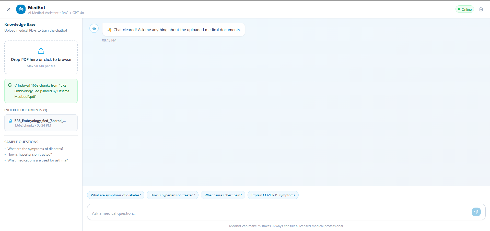

# 🏥 MedBot — AI Medical Chatbot (RAG Architecture)

A production-ready full-stack medical chatbot powered by **Retrieval-Augmented Generation (RAG)**. Upload medical PDFs and ask domain-specific questions — MedBot retrieves relevant context from your documents and generates accurate, grounded answers using GPT-4o.



---

## 🏗️ Project Structure

```
medical-chatbot-rag/
├── backend/                        # Python Flask API
│   ├── app.py                      # Flask entry point
│   ├── config.py                   # Environment config
│   ├── requirements.txt            # Python dependencies
│   ├── .env.example                # Environment variable template
│   ├── routes/
│   │   ├── chat.py                 # POST /api/chat
│   │   └── upload.py               # POST /api/upload
│   ├── services/
│   │   ├── rag_service.py          # Core RAG orchestration
│   │   ├── embeddings.py           # HuggingFace embeddings
│   │   └── pinecone_service.py     # Pinecone vector DB
│   └── utils/
│       └── pdf_processor.py        # PDF parsing & chunking
│
├── frontend/                       # React + Vite + Tailwind
│   ├── index.html
│   ├── vite.config.js
│   ├── tailwind.config.js
│   └── src/
│       ├── App.jsx                 # Root layout
│       ├── main.jsx
│       ├── index.css
│       ├── components/
│       │   ├── ChatWindow.jsx      # Message list
│       │   ├── MessageBubble.jsx   # Individual message
│       │   ├── InputBar.jsx        # Text input + send
│       │   └── UploadPanel.jsx     # PDF upload sidebar
│       ├── hooks/
│       │   └── useChat.js          # Chat state management
│       └── services/
│           └── api.js              # Axios API calls
│
├── .gitignore
└── README.md
```

---

## ⚙️ How RAG Works Here

```
User Question
     │
     ▼
Embed question (HuggingFace all-MiniLM-L6-v2)
     │
     ▼
Semantic search in Pinecone (top-5 chunks)
     │
     ▼
Inject context + question → GPT-4o
     │
     ▼
Grounded, accurate medical answer
```

---

## 🚀 Setup & Installation

### Prerequisites
- Python 3.11+
- Node.js 18+
- [OpenAI API Key](https://platform.openai.com/api-keys)
- [Pinecone API Key](https://www.pinecone.io/) (free tier works)

---

### 1. Clone the Repository

```bash
git clone https://github.com/firoz1860/medical-chatbot-rag.git
cd medical-chatbot-rag
```

---

### 2. Backend Setup

```bash
cd backend

# Create virtual environment
python -m venv venv
source venv/bin/activate        # Windows: venv\Scripts\activate

# Install dependencies
pip install -r requirements.txt

# Configure environment
cp .env.example .env
# Edit .env and add your API keys

# Go to project backend folder
cd "D:\Genrative Ai\project\medical-chatbot-rag\backend"

# Delete old broken venv if exists
Remove-Item -Recurse -Force venv

# Create new virtual environment using Python 3.12
py -3.12 -m venv venv

# Activate virtual environment
.\venv\Scripts\Activate

# Check python version (should be Python 3.12.x)
python --version

# Upgrade pip
pip install --upgrade pip

# Install all requirements
pip install -r requirements.txt

# Run backend (example)
python app.py
```

**Edit `.env`:**
```env
OPENAI_API_KEY=sk-your-openai-key-here
PINECONE_API_KEY=your-pinecone-key-here
PINECONE_ENV=us-east-1
PINECONE_INDEX=medical-chatbot
```

```bash
# Run the backend
python app.py
# API running at http://localhost:5000
```

---

### 3. Frontend Setup

```bash
cd ../frontend

# Install dependencies
npm install

# Configure environment
cp .env.example .env
# VITE_API_URL=http://localhost:5000/api  (default is fine for local dev)

# Start dev server
npm run dev
# App running at http://localhost:5173
```

---

## 📡 API Endpoints

| Method | Endpoint | Description |
|--------|----------|-------------|
| GET | `/api/health` | Health check |
| POST | `/api/chat` | Send a question, get RAG answer |
| POST | `/api/upload` | Upload and index a medical PDF |
| DELETE | `/api/delete/<doc_name>` | Remove document from knowledge base |

### POST `/api/chat`
```json
{
  "question": "What are the symptoms of Type 2 diabetes?",
  "chat_history": []
}
```
**Response:**
```json
{
  "answer": "Type 2 diabetes symptoms include...",
  "sources_found": true,
  "chunks_used": 4,
  "model": "gpt-4o"
}
```

---

## 🌐 Deployment

### Backend → Render / Railway / EC2
```bash
# Render: set environment variables in dashboard
# Start command:
gunicorn app:app --bind 0.0.0.0:5000
```

### Frontend → Vercel
```bash
cd frontend
npm run build
# Connect GitHub repo to Vercel
# Set VITE_API_URL to your deployed backend URL
```

---

## 🛠️ Tech Stack

| Layer | Technology |
|-------|-----------|
| Frontend | React 18, Vite, Tailwind CSS |
| Backend | Python 3.11, Flask, Flask-CORS |
| Embeddings | HuggingFace `all-MiniLM-L6-v2` |
| Vector DB | Pinecone (Serverless) |
| LLM | OpenAI GPT-4o |
| Orchestration | LangChain |
| PDF Parsing | PyMuPDF |
| Deployment | Vercel (FE), Render/EC2 (BE) |

---

## 👨‍💻 Author

**Firoz Ahmad**  
[GitHub](https://github.com/firoz1860) · [LinkedIn](https://www.linkedin.com/in/firoz-ahmad-020166251/)
